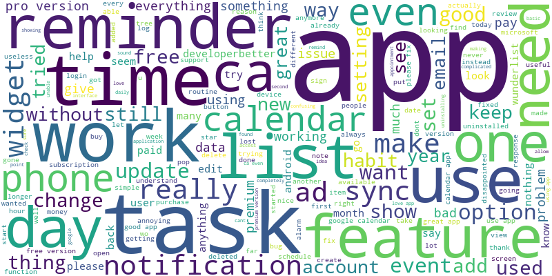

Here is a README file for your Git repository:

---

# Analyzing Negative Google Play Store Reviews using K-means Clustering and Latent Dirichlet Allocation



## Project Overview

This project aims to analyze negative reviews from the Google Play Store to understand user complaints and identify recurring issues. By applying K-means clustering and Natural Language Processing (NLP) techniques, the reviews are categorized into distinct clusters, providing deeper insights into the common themes among dissatisfied users.

## Dataset

The dataset contains reviews from the Google Play Store, including the following columns:

- `content`: The text content of each review.
- `score`: The score assigned to the review by the user, ranging from 1 to 5.

For this analysis, we focus on the reviews with scores of 1 or 2, representing the most negative feedback.

## Project Structure

```
.
├── notebook.ipynb
├── requirements.txt
├── reviews.csv
├── wordcloud.png
└── README.md
```

## Requirements

To install the required packages, run:
```bash
pip install -r requirements.txt
```

## Usage

1. **Data Loading and Exploration**:
    - Load the reviews dataset and display the first few rows to understand its structure.

2. **Data Preprocessing**:
    - Filter negative reviews (scores 1 or 2).
    - Preprocess the text by converting it to lowercase, tokenizing, and removing stopwords and non-alphabetic tokens.

3. **TF-IDF Vectorization**:
    - Convert the cleaned text into numerical features using TF-IDF vectorization.

4. **Clustering Analysis**:
    - Apply K-means clustering.
    - Determine the optimal number of clusters using silhouette scores and the elbow method.
    - Assign clusters to the reviews.

5. **PCA Visualization**:
    - Reduce the dimensionality of the TF-IDF vectors using PCA.
    - Visualize the clusters in 2D space.

6. **Latent Dirichlet Allocation (LDA)**:
    - Apply LDA to uncover overarching themes within the text data.
    - Display the top words for each topic.

7. **Additional Analysis**:
    - Identify and display the most common terms in each cluster.
    - Perform sentiment analysis on the reviews and calculate the average sentiment polarity for each cluster.

8. **Word Cloud**:
    - Generate a word cloud from the cleaned text of negative reviews to visualize the most frequent terms.


